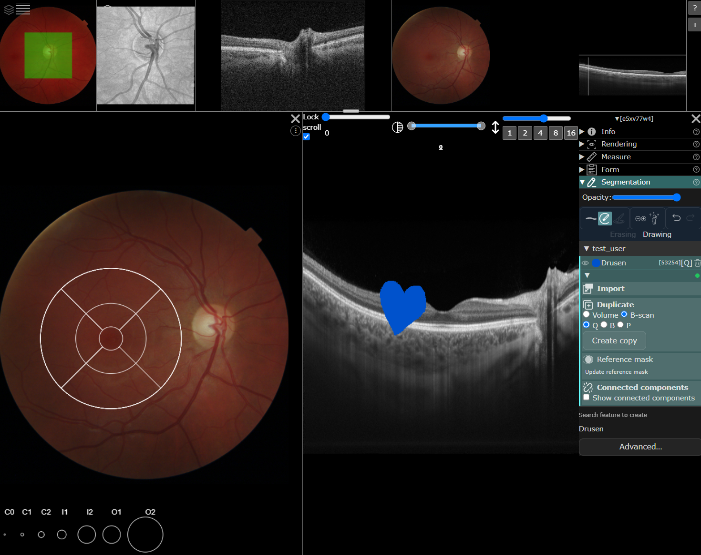

# EyeNED Platform

Open-source web platform for browsing, annotating, and managing ophthalmic imaging
(enface, OCT, DICOM, and more). Built by the [EyeNED Reading Centre](https://www.eyened.nl)
and partners in the OS4OD consortium.
[Documentation](https://eyened.github.io/eyened-platform/) ·
[Getting started](https://eyened.github.io/eyened-platform/getting_started/) ·
[Discussions](https://github.com/Eyened/eyened-platform/discussions)

## Features

- Loading of various image formats including DICOM.
- Convenient system for browsing loaded studies and images.
- Task system for managing grading tasks.
- Drawing tools for image segmentation of enface images and OCT B-scans
- Responsive web interface for accurate drawing
- Image enhancements such as contrast enhancement and CLAHE applied on the fly.
- Integrated tools for registration of enface images, including enface projections of segmentations across linked images
- Automated ETDRS grid placement via AI-based bounds detection and landmark detection.
- Python-based import script for loading images and associated metadata.
- For advanced use cases, our ORM allows data scientists to query the database directly.

See our [Documentation](https://eyened.github.io/eyened-platform/).

## Repository overview

***client:*** SvelteKit-based frontend application with DICOM image viewing capabilities using Cornerstone.js. Features include image annotation tools, drawing tools for 2D segmentation, and real-time image enhancements.

***dev:*** Development environment setup with Docker Compose configuration, environment variables, and scripts for starting development servers. Includes database mirroring tools and migration management.

***docker:*** Production Docker configuration with multi-stage builds for server, worker, and fileserver components. Includes nginx configuration and deployment scripts.

***docs:*** Astro-based documentation. Contains project documentation, API references, and user guides.

***orm:*** SQLAlchemy-based Object-Relational Mapping library for database interactions. Includes migration management with Alembic, data models, and utilities for data scientists to work with the database.

***server:*** FastAPI-based backend server providing REST API endpoints for image management, user authentication, task management, and database operations.

## License and contact
AGPL-3.0. Questions and contributions: GitHub Discussions, issues, or eyened@erasmusmc.nl.