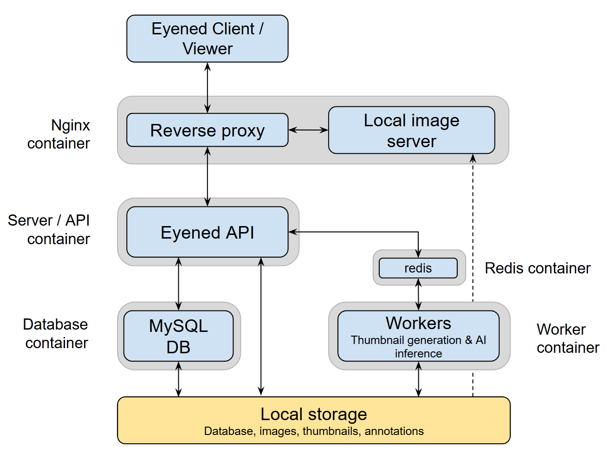

The Eyened platform is a modern web platform for visualization and annotation of ophthalmic images with features like:

- Loading of various image formats including DICOM.
- Convenient system for browsing loaded studies and images.
- Task system for managing grading tasks.
- Drawing tools for 2D image segmentation of enface images and OCT B-scans
- Images and annotations are rendered in the browser, making it very responsive and easy to set up.
- Image enhancements such as CLAHE can be applied on the fly.
- Integrated tools for registration of enface images.
- Automated ETDRS grid placement via AI-based bounds detection and landmark detection (fovea, optic disc) upon insertion of CFI images.
- Python-based import script for loading images and associated metadata.
- Authentication system can secure the viewer, images, thumbnails and annotations.
- For advanced use cases, our ORM allows data scientists to more easily work with the database.

## Quick Setup

The easiest way to get started with the eyened platform is by configuring and running our docker-compose on a server accessible within your network (admin privileges are necessary). Our containers will create a setup like the following:



With this setup you will be able to:

- Run the client / viewer, initially on an empty database.
- Run our import script to import local images and associated metadata into the system. Access to the images through the Eyened platform will be protected by authentication.
- A MySQL database will be created for the app's data in the local filesystem.
- Annotations and image thumbnails will be stored in local folders by the Eyened server.
- Redis is used for task queue management and caching.
- Adminer is included for database management (accessible on port 8080).

:::caution
Make sure to set up regular back ups for both the MySQL database and storage folders.
:::

### Setup

You can set up the Eyened platform in two ways:

#### Option 1: Automated Setup (Recommended)

We provide a setup script that automates the installation process and includes enhanced security features:

1. Clone our repository:

    ```bash
    git clone https://github.com/Eyened/eyened-platform.git eyened_platform
    ```

2. Run the setup script:

    ```bash
    cd eyened_platform/docker
    chmod +x setup.sh
    ./setup.sh
    ```

The script will:
- Check for required dependencies (Docker and Docker Compose)
- Prompt you for configuration settings or use defaults
- Create and configure the `.env` file
- Create necessary directories for images, storage, and database
- Generate secure random passwords for:
  - Admin user
  - Database root user
  - Database application user
- Build and start the containers
- Save your credentials to a secure file
- Display the URLs for accessing the platform

:::note
The setup script will create a `.platform_credentials` file containing your login information. This file has restricted permissions (600) for security. Please keep this file secure and delete it after you've noted the credentials.
:::

#### Option 2: Manual Setup

If you prefer to set up manually:

1. Clone our repository:

    ```bash
    git clone https://github.com/Eyened/eyened-platform.git eyened_platform
    ```

2. Navigate to the docker directory:

    ```bash
    cd eyened_platform/docker
    ```

3. Create a `.env` file with the following variables:

    | Variable | Description | Default |
    | --- | --- | --- |
    | PORT | Port the app will be served on | 80 |
    | ADMIN_USERNAME | Username for the default admin user | admin |
    | ADMIN_PASSWORD | Password for the default admin user | (randomly generated) |
    | IMAGES_BASEPATH | Local folder to serve images from (may be read-only) | $HOME/eyened-platform/images |
    | STORAGE_BASEPATH | Local path to store annotations, thumbnails and other generated files | $HOME/eyened-platform/storage |
    | DATABASE_PATH | Path to the database files | $HOME/eyened-platform/database |
    | DATABASE_PORT | Port to access the database from outside | 3306 |
    | DATABASE_ROOT_PASSWORD | Root password for external database access | (randomly generated) |
    | DATABASE_USER | Username for database access | eyened |
    | DATABASE_PASSWORD | Password for database access | (randomly generated) |

4. Create the necessary directories:

    ```bash
    mkdir -p $HOME/eyened-platform/{images,storage,database}
    ```

5. Start the platform:

    ```bash
    USERID=$(id -u) GROUPID=$(id -g) docker-compose up -d
    ```

### Accessing the Platform

Once the platform is running:

1. The viewer will be available at `http://<HOSTNAME>:<PORT>` from within your network
2. Adminer (database management) will be available at `http://<HOSTNAME>:8080`

To manage the platform:

- To view logs: `docker-compose logs -f`
- To stop the platform: `docker-compose down`
- To start the platform: `USERID=$(id -u) GROUPID=$(id -g) docker-compose up -d`

:::note
To access Adminer, use the following credentials:
- System: MySQL
- Server: database
- Username: root
- Password: (your DATABASE_ROOT_PASSWORD)
:::

### Next Steps

To import data into the platform, follow the [Importer guide](/eyened-platform/importer).
