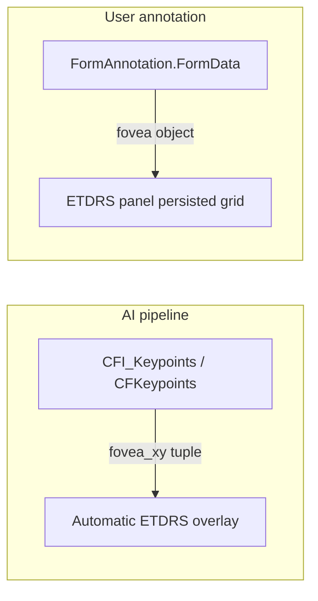

Form annotations store structured JSON attached to patients, studies, or images. Each annotation references a **FormSchema** that defines the JSON Schema for validation and (for clinical forms) the fields shown in the Form panel.

## FormSchema and FormAnnotation

| Entity | Role |
|--------|------|
| `FormSchema` | Defines `SchemaName`, JSON Schema (`Schema`), and `EntityType` (Patient, Study, StudyEye, Eye, ImageInstance, …) |
| `FormAnnotation` | Stores `FormData` JSON for one entity instance, linked to a schema and creator |

See **[Form annotations](/eyened-platform/orm/data_model/form_annotations)** for the ORM model.

Clinical grading forms (AMD, glaucoma, naevi, etc.) are **site-specific** and are inserted per deployment. Viewer infrastructure schemas are **builtin** and shipped with the platform.

## Builtin viewer schemas

These schemas are required for ETDRS and registration panels. They are defined in version-controlled JSON under `orm/eyened_orm/form_schemas/` and listed in `registry.py`.

They are **hidden from the generic Form panel** in the viewer and managed through dedicated panels (ETDRS, Registration).

| Schema name | Entity type | Purpose |
|-------------|-------------|---------|
| `ETDRS-grid coordinates` | ImageInstance | Manual ETDRS grid placement (`fovea`, `disc_edge`) |

Registration schemas (`Pointset registration`, `Affine registration`, `RegistrationSet`) are also seeded here — semantics, JSON shapes, and viewer behaviour are documented in **[Registration](/eyened-platform/orm/registration)**.

## Seeding builtin schemas

Builtin schemas are **not** inserted automatically on every server start. Seed them once after initializing the database:

```bash
eorm initialize-database
eorm seed-form-schemas
eorm create-user
```

Or combine table creation and seeding:

```bash
eorm initialize-database --seed-form-schemas
```

### Idempotent behavior

- **Default:** inserts missing schemas; skips schemas that already exist (matched by `SchemaName`).
- **`--update`:** refreshes `Schema` JSON and `EntityType` from the bundled files for existing builtin schemas.

```bash
eorm seed-form-schemas --update
```

After seeding or changing schemas, validate the database:

```bash
eorm validate-forms
```

## Fovea coordinate storage

Fovea and optic-disc landmarks appear in different places depending on how they were produced:



| Storage | Column / table | JSON shape | Written by |
|---------|----------------|------------|------------|
| AI keypoints | `CFI_Keypoints` (`AttributeValue`), or legacy `ImageInstance.CFKeypoints` | `{ "fovea_xy": [x,y], "disc_edge_xy": [x,y], … }` | `eorm run-cfi-models` / CFI import |
| Manual ETDRS grid | `FormAnnotation.FormData` | `{ "fovea": {x,y}, "disc_edge": {x,y} }` | ETDRS edit tool → `PUT /form-annotations/{id}/value` |

Both use **full-resolution image pixel coordinates**. See **[ETDRS Grid Panel](/eyened-platform/client/panels/etdrs)** for the viewer workflow.

## Adding a clinical FormSchema

For site-specific grading forms, insert a `FormSchema` row manually or via import. Example from a Python session:

```python
import json
from eyened_orm import FormSchema, Database, EntityType

schema = json.load(open("my_form_schema.json"))
with db.get_session() as session:
    formschema = FormSchema(
        SchemaName="AMD Grading",
        Schema=schema,
        EntityType=EntityType.StudyEye,
    )
    session.add(formschema)
    session.commit()
```

The JSON file must be a valid JSON Schema (Draft 7). Use `eorm validate-forms` to check schemas and existing annotation data.

## Point widgets (`x-eyened-widget`)

The viewer understands an optional vendor extension on field (or root) schemas:

```json
"x-eyened-widget": "keypoint"
```

When present, SchemaForm shows a **PointField** with an Activate control that arms a shared viewer `PointTool` (place with LMB, delete with RMB). Behavior comes from ordinary JSON Schema shape:

| Schema shape | Meaning |
|--------------|---------|
| `type: "object"` with `x` / `y` | Single landmark |
| `type: "array"` of point objects | List of landmarks (delete removes and closes the gap) |
| `type: "array"` of point **or** `null` | Sparse list (mid-list delete leaves a hole; used when indices must stay aligned across images) |
| `additionalProperties` → point or array of points | Per-image map keyed by image **PublicID**; the tool edits the entry for the image you are viewing |

Validators ignore `x-eyened-*` keys. See [point-widget-schema-examples.md](../../../point-widget-schema-examples.md) for full examples.

On **OCT volumes** (B-scans), the tool stores a numbered slice `index`. On the volume's **enface projection** (`*_proj`), it stores `index: null` so enface landmarks stay distinct from B-scan points (they share the same ImageInstance PublicID). Plain 2D images omit `index`. Visibility follows that tag: enface shows `index == null`, each B-scan shows only its slice number. If the point object schema uses `additionalProperties: false`, declare `index` as a number-or-null property so validation accepts both.

Form **Activate** publishes an armed field on a shared bridge (`pointArming`). Each open **MainViewer** mounts its own `PointTool` against that session, so placement works on every main panel.

After changing builtin JSON, refresh DB rows with:

```bash
eorm seed-form-schemas --update
```

## TaskConfig for grading tasks

Task-specific form selection is configured on **`TaskDefinition.TaskConfig`**.

```json
{
  "form_schema_name": "New ergo grading form",
  "update_subtask_image_links": true,
  "layout": {
    "hide": ["Form"],
    "prepend": [
      {
        "type": "quick-form",
        "title": "Grading",
        "expanded": true
      }
    ]
  }
}
```

TaskConfig is merged over client defaults (`client/src/lib/config/clientDefaults.ts`). Attachment scope comes from **`FormSchema.EntityType`** (not TaskConfig).

| Field | Meaning |
|-------|---------|
| `form_schema_name` | `FormSchema.SchemaName` to pre-select in the Form panel when the task is active (clinical forms only; builtin ETDRS and registration schemas are excluded). Also used by the `quick-form` layout panel. |
| `update_subtask_image_links` | Default for the browser overlay “Update task image links” checkbox (overrides client default `false`). |
| `layout.hide` | Builtin sidebar panel names to omit (e.g. `"Form"`) |
| `layout.prepend` | Custom panels inserted before the default sidebar list |
| `layout.prepend[].type` | Panel type — v1 supports `"quick-form"` |
| `layout.prepend[].title` | Panel header label (e.g. `"Grading"`) |
| `layout.prepend[].expanded` | When `true`, panel starts expanded |

Example task import row (see **[Importer — tasks](/eyened-platform/orm/importer)**):

```python
ImportTaskRow(
    task_definition_name="Naevi grading",
    task_definition_config={
        "form_schema_name": "Naevi grading",
        "update_subtask_image_links": True,
        "layout": {
            "hide": ["Form"],
            "prepend": [
                {
                    "type": "quick-form",
                    "title": "Grading",
                    "expanded": True,
                }
            ],
        },
    },
    task_name="Naevi batch 2025",
    creator_name="admin",
)
```

The corresponding `FormSchema` must exist in the database before graders open the task — it is **not** included in `eorm seed-form-schemas`.

## API

Form schemas are read-only via the API:

- `GET /api/form-schemas` — list all schemas
- `GET /api/form-schemas/{id}` — single schema

Form annotations are created and updated via `/api/form-annotations`. See **[API — Import](/eyened-platform/api/import)**
