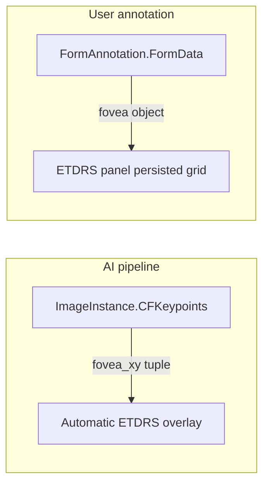

Form annotations store structured JSON attached to patients, studies, or images. Each annotation references a **FormSchema** that defines the JSON Schema for validation and (for clinical forms) the fields shown in the Form panel.

## FormSchema and FormAnnotation

| Entity | Role |
|--------|------|
| `FormSchema` | Defines `SchemaName`, JSON Schema (`Schema`), and `EntityType` (Patient, Study, StudyEye, ImageInstance, …) |
| `FormAnnotation` | Stores `FormData` JSON for one entity instance, linked to a schema and creator |

See **[Database Entities — Form Annotations](/eyened-platform/orm/entities#form-annotations)** for the full ORM model.

Clinical grading forms (AMD, glaucoma, naevi, etc.) are **site-specific** and are inserted per deployment. Viewer infrastructure schemas are **builtin** and shipped with the platform.

## Builtin viewer schemas

These schemas are required for ETDRS grid and registration panels. They are defined in version-controlled JSON under `orm/eyened_orm/form_schemas/` and listed in `registry.py`.

| Schema name | Entity type | Purpose |
|-------------|-------------|---------|
| `ETDRS-grid coordinates` | ImageInstance | Manual ETDRS grid placement (`fovea`, `disc_edge`) |
| `Pointset registration` | ImageInstance | Point-set registration between images |
| `Affine registration` | ImageInstance | Stored affine transforms between image pairs |
| `RegistrationSet` | ImageInstance | Composite registration transforms |

These schemas are **hidden from the generic Form panel** in the viewer. They are managed through dedicated panels (ETDRS, Registration) or loaded into the registration system.

The client uses the same schema names in `client/src/lib/config/builtinFormSchemas.ts` — keep this file in sync with `registry.py` when adding or renaming builtin schemas.

## Seeding builtin schemas

Builtin schemas are **not** inserted automatically on every server start. Seed them once after initializing the database:

```bash
eorm initialize-database
eorm seed-form-schemas
eorm create-user
```

Or combine table creation and seeding:

```bash
eorm initialize-database --seed-form-schemas
```

### Idempotent behavior

- **Default:** inserts missing schemas; skips schemas that already exist (matched by `SchemaName`).
- **`--update`:** refreshes `Schema` JSON and `EntityType` from the bundled files for existing builtin schemas.

```bash
eorm seed-form-schemas --update
```

After seeding or changing schemas, validate the database:

```bash
eorm validate-forms
```

## Fovea coordinate storage

Fovea and optic-disc landmarks appear in different places depending on how they were produced:



| Storage | Column / table | JSON shape | Written by |
|---------|----------------|------------|------------|
| AI keypoints | `ImageInstance.CFKeypoints` | `{ "fovea_xy": [x,y], "disc_edge_xy": [x,y], … }` | `eorm run-models` / CFI import |
| Manual ETDRS grid | `FormAnnotation.FormData` | `{ "fovea": {x,y}, "disc_edge": {x,y} }` | ETDRS edit tool → `PUT /form-annotations/{id}/value` |

Both use **full-resolution image pixel coordinates**. See **[ETDRS Grid Panel](/eyened-platform/client/etdrs_panel)** for the viewer workflow.

## Adding a clinical FormSchema

For site-specific grading forms, insert a `FormSchema` row manually or via import. Example from a Python session:

```python
import json
from eyened_orm import FormSchema, Database, EntityType

schema = json.load(open("my_form_schema.json"))
with db.get_session() as session:
    formschema = FormSchema(
        SchemaName="AMD Grading",
        Schema=schema,
        EntityType=EntityType.StudyEye,
    )
    session.add(formschema)
    session.commit()
```

The JSON file must be a valid JSON Schema (Draft 7). Use `eorm validate-forms` to check schemas and existing annotation data.

## TaskConfig for grading tasks

Task-specific form selection is configured on **`TaskDefinition.TaskConfig`**, not hardcoded in the viewer.

```json
{
  "form_schema_name": "Naevi grading",
  "form_image_scope": true
}
```

| Field | Meaning |
|-------|---------|
| `form_schema_name` | `FormSchema.SchemaName` to pre-select in the Form panel when the task is active (clinical forms only; builtin ETDRS and registration schemas are excluded) |
| `form_image_scope` | When `true`, list only form annotations for the current image |

Example task import row (see **[Importer — tasks](/eyened-platform/orm/importer)**):

```python
ImportTaskRow(
    task_definition_name="Naevi grading",
    task_definition_config={
        "form_schema_name": "Naevi grading",
    },
    task_name="Naevi batch 2025",
    creator_name="admin",
)
```

The corresponding `FormSchema` must exist in the database before graders open the task — it is **not** included in `eorm seed-form-schemas`.

## API

Form schemas are read-only via the API:

- `GET /api/form-schemas` — list all schemas
- `GET /api/form-schemas/{id}` — single schema

Form annotations are created and updated via `/api/form-annotations`. See **[API Reference](/eyened-platform/api/reference)**.
