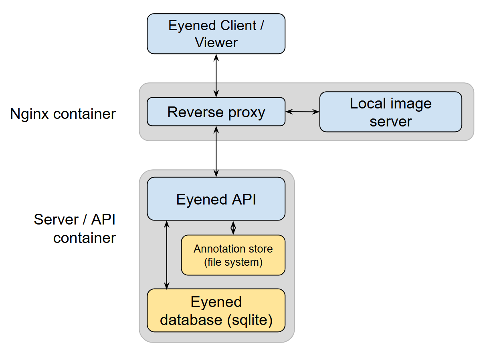

The Eyened platform consists of several interconnected services that work together to provide a complete ophthalmic image management and annotation solution.

## Architecture Overview

## Core Services

### Client
- Web-based viewer built with Svelte and webgl2
- Browser-based rendering of images and annotations

### API Server
- FastAPI backend for data management and business logic
- Task queue system (Huey/Redis) for managing long-running operations

### Data Management
- MySQL database (8.0.27) for structured data storage
- Adminer interface for database management (accessible on port 8080)
- Local filesystem storage for:
  - Original images
  - Generated thumbnails
  - Annotation data

### Development Tools
- API-calls and Python-based import script for loading images and associated metadata
- ORM layer for data scientists to interact with the database

For detailed setup instructions, see the [Getting Started](/eyened-platform/getting_started) guide.
