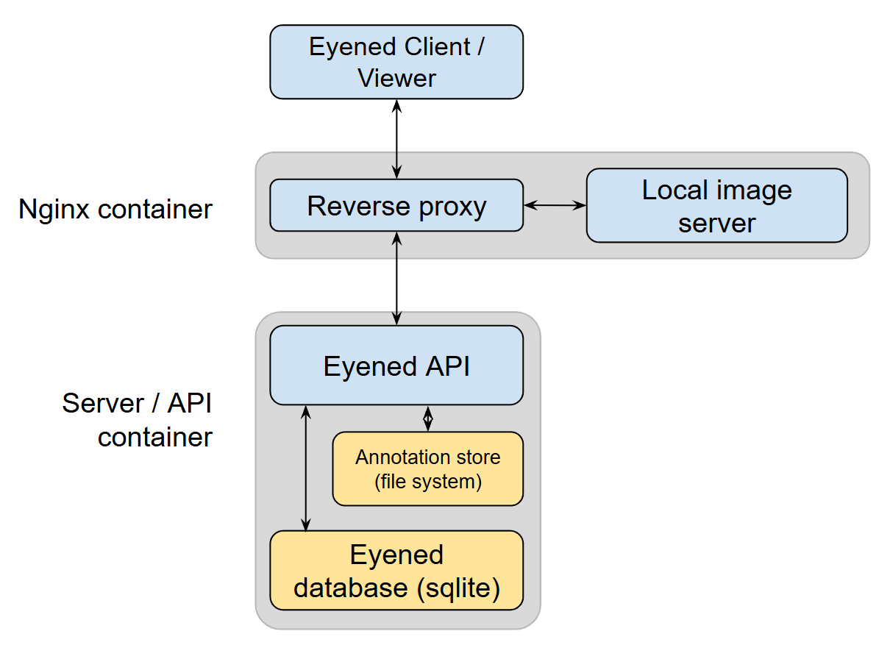

EyeNED is a web platform for browsing, annotating, and managing ophthalmic images. A typical deployment runs several Docker services behind a single nginx entry point; MySQL holds metadata and relationships, while image files live on mounted storage.

## Architecture Overview

**Request flow:** the browser talks to **fileserver** (nginx) on `PORT` (set in `docker/.env`, default `80`). Nginx proxies `/` to the **client** (viewer UI) and `/api/` to the **server** (FastAPI). Image bytes and thumbnails are served via nginx internal redirects — the API validates access, then tells nginx which file to send.

## Runtime services

These run from `docker/docker-compose.yaml`:

| Service | Role |
|---------|------|
| **Fileserver** | nginx reverse proxy; single entry point for UI, API, thumbnails, and image datasets |
| **Client** | SvelteKit viewer with WebGL2 rendering for images and segmentations |
| **Server** | FastAPI backend — authentication, database access, business logic; enqueues long jobs to Redis |
| **Redis** | Job broker for async work (`EYENED_REDIS_HOST`, `EYENED_REDIS_PORT`, `EYENED_REDIS_PASSWORD`) |

The server also needs `EYENED_API_SECRET_KEY` and the `EYENED_DATABASE_*` variables (see below).

**Worker** is deployed separately (`python -m server.rq_worker` or a worker Docker compose file). It uses the same `EYENED_REDIS_*`, `EYENED_DATABASE_*`, and storage env as the server. Set `EYENED_RQ_WORKER_QUEUES` to the queues it should consume (include `default` for thumbnail jobs). Without a worker, synchronous CLI paths still work; async API endpoints will queue jobs that never run.

## Database

MySQL stores all structured data: projects, patients, studies, images, annotations, tasks, users, and storage references. It is **not** bundled in the main compose stack — run the `database/` stack from the repository (`MYSQL_*` vars in `database/.env`) or point the app at an existing server via:

- `EYENED_DATABASE_HOST`
- `EYENED_DATABASE_PORT`
- `EYENED_DATABASE_USER`
- `EYENED_DATABASE_PASSWORD`
- `EYENED_DATABASE_DATABASE`

Optional **Adminer** in the database stack is exposed on `EYENED_ADMINER_PORT` (default `8080`).

See [Getting Started](/eyened-platform/getting_started) for setup.

## API concurrency

Route handlers that touch the database run in a threadpool, not on the event loop. One slow query occupies one thread; unrelated requests keep being served.

Six endpoints deliberately stay on the loop. Five of them are the segmentation-data endpoints in `server/routes/segmentations.py`: the zarr store behind them has no lock, so the single-threaded event loop is the only thing serializing concurrent writes to the same array, and moving them into the threadpool loses annotation data. The sixth is the OIDC login callback, which awaits the identity provider, so its two queries stay on the loop as well.

Four settings size that threadpool and the connection pool behind it:

| Setting | Default | What it caps |
|---------|---------|--------------|
| `EYENED_API_THREADPOOL_LIMIT` | `16` | All sync work offloaded to threads (handlers, dependencies, background tasks), per server process |
| `EYENED_API_POOL_SIZE` | `16` | Pooled connections held open, per server process |
| `EYENED_API_MAX_OVERFLOW` | `4` | Extra connections opened under burst, per server process |
| `EYENED_API_POOL_TIMEOUT` | `5` | Seconds a request waits for a free connection before failing |

`EYENED_API_THREADPOOL_LIMIT` must not exceed `EYENED_API_POOL_SIZE` + `EYENED_API_MAX_OVERFLOW`, and a startup validator makes the **server** refuse to boot if it does — what that catches is a grossly undersized pool, the case where threads sit in `pool.connect()` waiting out the timeout. It does not guarantee a checkout never waits: a request holds its connection across several threadpool hops (each sync dependency, the endpoint, response-model validation), so checkouts can exceed the thread count — 20 against 16 threads, measured.

`EYENED_API_POOL_TIMEOUT` is deliberately outside that validated relation: it changes not how many connections exist but how long a request waits for one, turning pool exhaustion into a fast error rather than the 30-second hang SQLAlchemy defaults to — and which the worker, the CLI and the importer still use.

### Connection budget

Every process has its own pool. Connections open lazily, so the numbers below are ceilings, and at peak the database sees the sum:

| Consumer | Processes | Per process | Total |
|----------|-----------|-------------|-------|
| **Server** (`docker/`, gunicorn) | `WORKERS` (default `4`, set in `docker/.env`) | 20 | 80 |
| **Server** (`dev/`, single uvicorn) | 1 | 20 | 20 |
| **Worker** (RQ) | one pool per running job | 15 | varies with concurrency |
| `eorm` CLI / importer | occasional | 15 | varies |

That sum must stay under the database's `max_connections`. MySQL's documented default is `151`, and the `database/` stack does not override it — confirm the value on the target server before raising any of the settings above. Only the server's pool is tuned; the worker, the CLI and the importer all keep the conservative ORM default of 5 + 10.

To shrink the footprint, lower `EYENED_API_POOL_SIZE` and `EYENED_API_THREADPOOL_LIMIT` together — the startup validator rejects a threadpool larger than the pool.

## Storage

Two distinct layers:

**Image datasets** — original DICOM, PNG, etc. Files stay on disk (or object storage mounted into the container). Each file is registered in the database with a `storage_backend_key` and `object_key` (import/API fields; `StorageBackend.Key` and `ImageStorage.ObjectKey` in the database). Configure a matching nginx `location /{key}/` and read-only mount on the fileserver for each backend. The server and worker resolve local paths via the JSON env var `EYENED_STORAGE_MOUNTS` (e.g. `'{"local":"/path/to/images"}'`); the API serves files through nginx with `GET /api/images/{public_id}/data`.

**Platform storage** — writable data under `EYENED_STORAGE_ROOT` (default `/storage`):

| Path | Contents |
|------|----------|
| `thumbnails/` | JPEG previews (`_144.jpg`, `_540.jpg`); served by nginx at `/thumbnails/` |
| `segmentations.zarr` | Zarr store for user-drawn and model segmentations |

The server container mounts `EYENED_STORAGE_ROOT` read-write; the fileserver mounts `{EYENED_STORAGE_ROOT}/thumbnails` read-only.

## Loading data

Images must be on a storage backend **before** import — neither the ORM nor the API uploads files. The primary path is the [ORM importer](/eyened-platform/orm/importer) (Python/CLI, batch CSV, plan → review → apply). A [REST API](/eyened-platform/importing_data#rest-api-alternative) is available for integrations that cannot run the ORM directly.

After import, generate thumbnails separately — see [Thumbnails](/eyened-platform/thumbnails).

## Further reading

- [Getting Started](/eyened-platform/getting_started) — deploy the stack
- [Importing data](/eyened-platform/importing_data) — register images and metadata
- [Authentication](/eyened-platform/guides/authentication) — password login and optional OIDC
- [ORM Configuration](/eyened-platform/orm/configuration) — environment variables
